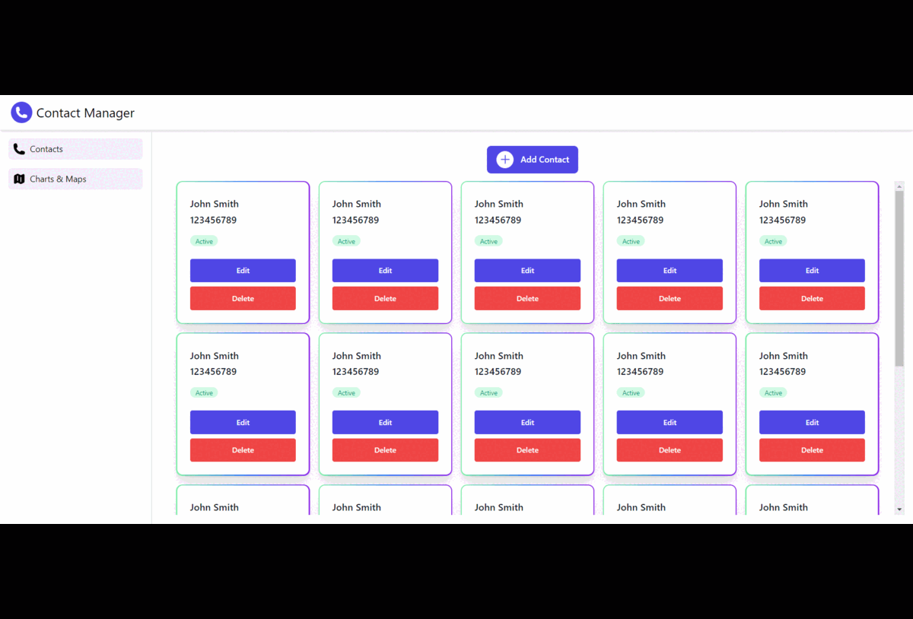

# Contact Manager

## 📷 Screenshots



## Steps to Run the App on Your Local Machine

1. Clone this repository onto your local machine

```shell
git clone https://github.com/Steevel/contact-manager.git
```

2. Change into the repository's directory and install npm packages using the command:

```shell
cd contact-manager
npm install
```

3. To run the app, execute the following command:

```shell
npm run dev
```
